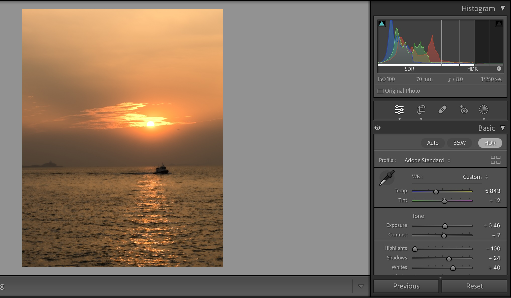
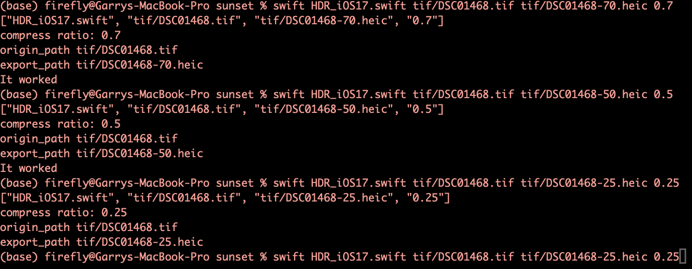

# HDR_Image_iOS17

### An app *HDR Compressor* supporting compressing raw/tiff/jpg image into heic format, including HDR image

[HDR Compressor](https://github.com/HCYANG2000/Generate_Apple_HDR_Photos/blob/main/HDR_Compressor.zip)

### A swift script to output 10bit HDR HEIC image for Apple Photos

**Support <u>macOS Sonoma and later</u> +  <u>Swift >=5.9</u>**

## Background

In the latest release of Lightroom and Adobe Camera Raw (October 2023), there's updated support for viewing, editing, and exporting HDR images. **When exporting HDR images, Adobe exclusively supports 16-bit PNG, TIFF, JPEG XL formats, and 10-bit AVIF files.**

With iOS 17, iPadOS 17, and macOS Sonoma, Apple's Photos app can now view all these formats. Despite this, Apple's default image format remains HEIC. **There are issues when viewing JPEG XL and AVIF files in the Photos app, as they require software decoding.** And, 16-bit PNG and TIFF files are not ideal for storage due to their large file sizes.

 

Apple's HEIC compress tool in Finder only supports non-HDR 8-bit compress. To output 10bit HDR HEIC image for Apple Photos, swift script is required (Apple provides such tools in latest version of Swift but not implement it into Finder...).

Apple's HEIC compression tool in Finder seems to have had a bit too outdated—it only supports non-HDR 8-bit compression. However, Apple provides 10-bit HDR HEIC transformation tools in the latest Swift version.

## Usage

### Enabling HDR in Lightroom/Adobe Camera Raw

### Output 16bit PNG/TIFF image 

### Output HEIC HDR image use swift script

`swift HDR_iOS17.swift $path_of_PNG/TIFF_image$ $path_to_output_heic$ $compress ratio$`

#### Example

#### Reminder

* Compress ratio in $(0, 1.0]$, suggest $\geq 0.75$, otherwise the file size is not enough for storing high dynamic range information
* Remember to Add '**.heic**' in output path

### Send to Apple Photos

* Enjoy the smooth viewing experience of HDR image in iPhone/iPad/Mac 

## Bash to process multiple files

### Put HDR images from Lightroom in one directory

### Use `hdr_bash.sh` to process multiple images

`Usage: bash hdr_bash.sh $directory_path $compress_ratio $num_of_threads`

#### Reminder

* Adjust `num_of_threads` based on your computer
* The output HEIC images are put inside the original directory

