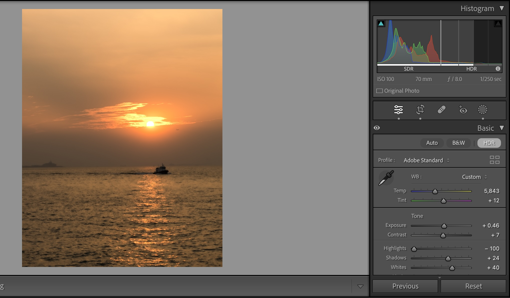
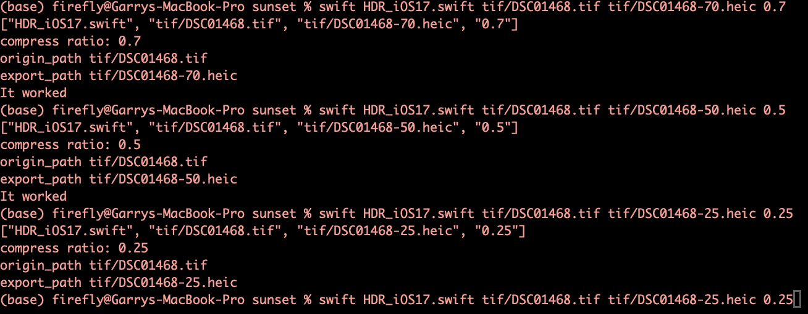

# HDR Image Converter for Apple Photos

Convert HDR photos (from Lightroom / Adobe Camera Raw) into 10-bit HEIC files that display correctly in Apple Photos on iPhone, iPad, and Mac.

**Requires macOS 26 (Tahoe) or later · Swift 5.9+**

---

## What's New

- Fixed "HDR" tag issue when importing RAW images
- Fixed HLG BT.2100 compression issue
- Partial support for GainMap HDR
  *(ideas from [PQ_HDR_to_Gain_Map_HDR](https://github.com/chemharuka/PQ_HDR_to_Gain_Map_HDR) and [Frank Rupprecht](https://gist.github.com/kiding/fa4876ab4ddc797e3f18c71b3c2eeb3a?permalink_comment_id=4289828#gistcomment-4289828))*
- Improved error messages and argument validation
- Added `--help` flag to the Swift script

---

## Background

When exporting HDR images from Lightroom or Adobe Camera Raw, the supported formats are 16-bit PNG/TIFF, JPEG XL, and 10-bit AVIF. While Apple Photos can open these, there are drawbacks:

- **AVIF / JPEG XL** require software decoding and can feel slow or buggy in Photos
- **PNG / TIFF** produce very large files

Apple's built-in HEIC tool in Finder only supports 8-bit SDR compression. This script uses Apple's CoreImage APIs (available in Swift) to write proper **10-bit HDR HEIC** files that Photos handles natively and efficiently.


---

## Quick Start

### Step 1 — Enable HDR in Lightroom / Adobe Camera Raw



### Step 2 — Export as 16-bit TIFF or PNG


### Step 3 — Convert with the Swift script

```bash
swift HDR_iOS17.swift <input> <output.heic> <quality> <mode>
```

Run `swift HDR_iOS17.swift --help` to see all options.

### Step 4 — Import into Apple Photos

Drag the `.heic` file into Photos and enjoy smooth HDR playback on any Apple device.

---

## Examples

The `example_images/` folder contains real sample photos to test with.

### JPEG → HDR HEIC (mode 5, recommended)

```bash
swift HDR_iOS17.swift example_images/DSC06294.JPG example_images/output/DSC06294_hdr.heic 0.85 5
```

### AVIF → HDR HEIC (mode 5)

```bash
swift HDR_iOS17.swift example_images/DSC05810.avif example_images/output/DSC05810_hdr.heic 0.85 5
```

### HEIC → HDR HEIC re-encode (mode 5)

```bash
swift HDR_iOS17.swift example_images/DSC07633.heic example_images/output/DSC07633_hdr.heic 0.85 5
```

### RAW (.ARW) → HDR HEIC (mode 7 — uses CIRAWFilter)

```bash
swift HDR_iOS17.swift example_images/DSC06175.ARW example_images/output/DSC06175_hdr.heic 1.0 7
```

> For RAW files, quality `1.0` is recommended. Use mode `7` (HLG) or `8` (PQ).



---

## Export Modes

| Mode | Bit depth | Color space    | Quality       | Best for                        |
|------|-----------|----------------|---------------|---------------------------------|
| 1    | 8-bit     | Display P3     | Compressed    | Standard SDR (smaller file)     |
| 2    | 8-bit     | Display P3     | Lossless      | Standard SDR (full quality)     |
| 3    | 10-bit    | Display P3     | Compressed    | Wide-gamut SDR (smaller file)   |
| 4    | 10-bit    | Display P3     | Lossless      | Wide-gamut SDR (full quality)   |
| **5**| **10-bit**| **BT.2100 HLG**| **Lossless**  | **HDR — recommended**           |
| 6    | 10-bit    | BT.2100 PQ     | Compressed    | HDR PQ (Dolby Vision-style)     |
| 7    | 10-bit    | BT.2100 HLG    | Lossless      | HDR from RAW (CIRAWFilter)      |
| 8    | 10-bit    | BT.2100 PQ     | Lossless      | HDR from RAW (CIRAWFilter)      |

**Quality tips:**
- Range is `0.1` to `1.0`
- Values below `0.75` may not store enough data for the full HDR range
- `0.85` is a good starting point for JPEG/AVIF/HEIC; use `1.0` for RAW

---

## Batch Processing with `compress.sh`

To convert an entire folder at once:

```bash
bash compress.sh <directory> <quality> <mode> [threads]
```

**Examples:**

```bash
# Convert all images in ./photos — HDR HLG mode, 4 parallel threads
bash compress.sh ./photos 0.85 5 4

# Convert the included sample images
bash compress.sh ./example_images 0.85 5 4
```

**Notes:**
- Output HEIC files are saved to `<directory>/heic/`
- Supported input: TIFF, JPEG, PNG, AVIF, HEIC, DNG, ARW, CR2, CR3, NEF, RAF
- Default thread count is 4; adjust based on your machine
- Run `bash compress.sh --help` for full usage

---

## Quality Comparison with `hdr_bash.sh`

`hdr_bash.sh` is an example script that sweeps through a range of quality values so you can compare output files and pick the best setting for your images.

Edit the filenames inside the script, then run:

```bash
bash hdr_bash.sh
```

---

## HDR Compressor App

A standalone macOS app version is also available:

[HDR Compressor](https://github.com/HCYANG2000/Generate_Apple_HDR_Photos/blob/main/HDR%20Compressor.zip)
